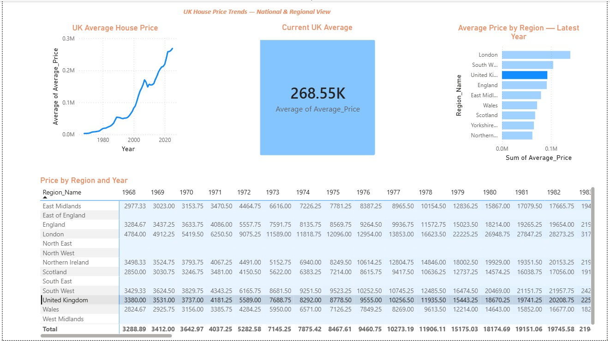
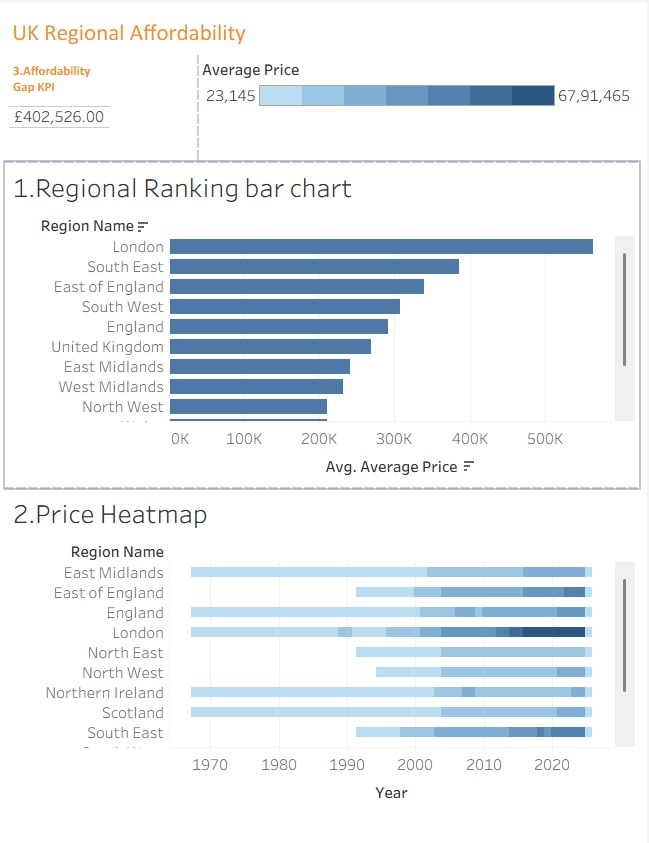

# uk-house-price-trends
UK House Price Index analysis using Python, SQL, Power BI, and Tableau
# UK House Price Trends Analysis

End-to-end data workflow analysing UK House Price Index data (HM Land Registry) across UK regions from 1968 to 2025. Built as a portfolio piece demonstrating a full data analysis workflow from raw CSV through Python EDA, SQL aggregation, and BI dashboards in both Power BI and Tableau.

## Key Findings

1. UK average house price rose from £82,534 in 2000 to £268,548 in 2025 — a 225.4% increase.
2. London consistently leads on absolute prices, with a £295,351 gap to the national average in 2025. However, Wales showed the strongest long-term growth since 2000 at 310%, outpacing London on percentage terms.
3. English regions correlate strongly with the national UK average (lowest correlation 0.958, highest 0.999), indicating UK-wide market forces dominate over regional variation.

## Dashboards

### Power BI — National & Regional Trends

### Tableau — Regional Affordability

Live Tableau dashboard: https://public.tableau.com/app/profile/bhavishya.guntreddi/viz/UKRegionalAffordability/UKRegionalAffordability

## Tech Stack

- Python (pandas, matplotlib) — data cleaning and exploratory analysis
- SQL (SQLite) — regional and temporal aggregations 
- Power BI Desktop — trend dashboard
- Tableau Public — affordability dashboard

## Dataset

UK House Price Index — HM Land Registry.
https://www.gov.uk/government/statistical-data-sets/uk-house-price-index-data-downloads

## Repository Structure

- `notebooks/` — Python EDA notebook
- `sql/` — SQL queries against the cleaned data
- `dashboard/` — Power BI and Tableau files with screenshots
- `charts/` — Output charts from the Python EDA
- `data/` — Source CSV and cleaned outputs

## Author

Bhavishya Guntreddi — MSc Artificial Intelligence, Northumbria University
